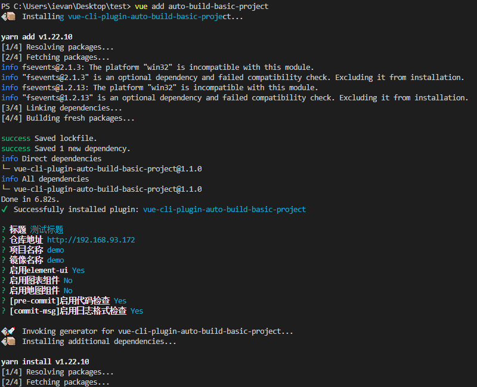

## auto-build-basic-project
> vue-cli插件，用于快速搭建前端基础工程

### 插件介绍
插件安装过程会自动配置以下内容:
* axios 封装
* rest接口 封装
* 环境变量统一管理
* scss预处理器
* webpack gzip压缩
* docker 镜像构建
* 工程说明文档

### 插件使用
在项目根目录使用`vue add auto-build-basic-project`命令完成依赖安装和自动配置

或者使用`vue ui`命令在可视化界面中，导入项目、搜索插件`auto-build-basic-project`，最后点击安装。

